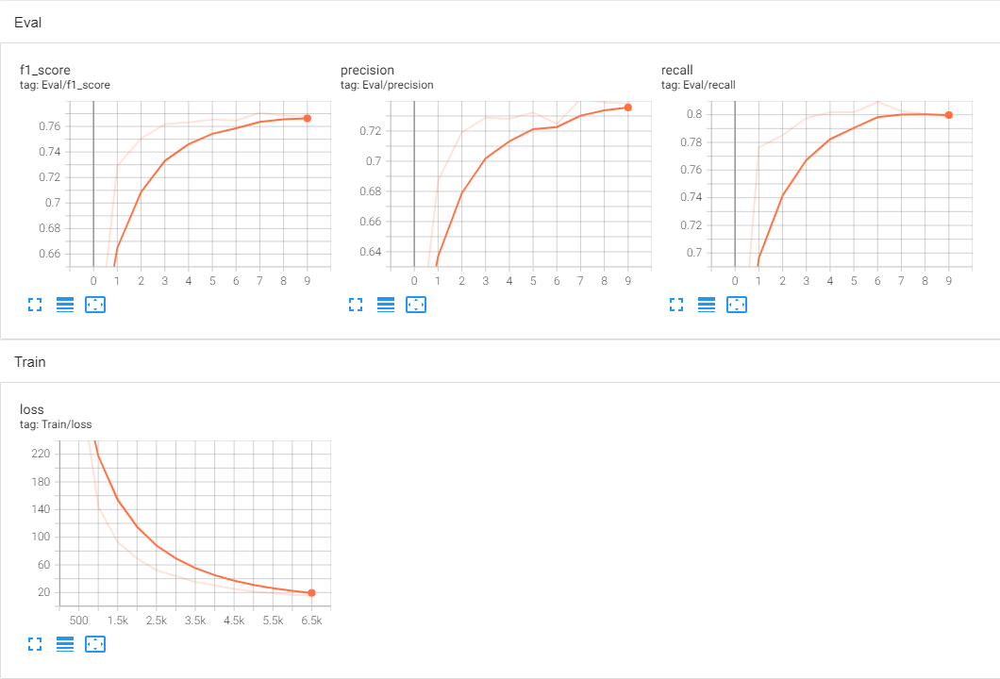
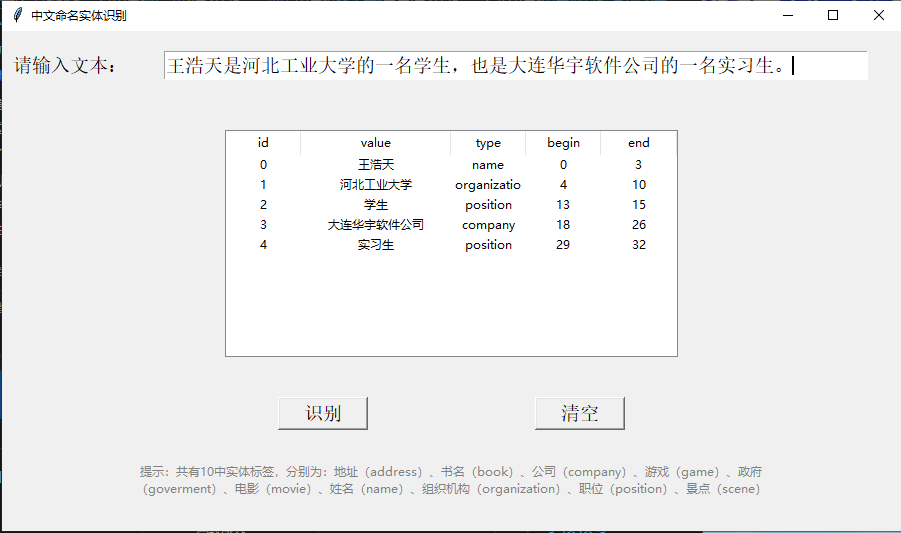

# BERT-BiLSTM-CRF模型

### 【简介】使用谷歌的BERT模型在BiLSTM-CRF模型上进行预训练用于中文命名实体识别

### 项目结构

```
|-- chinese_ner
    |-- torch_ner
        |-- data                                    ---ClUENER数据集
        |   |-- clue2bioes.py                       ---将json格式数据转为bioes数据格式
        |   |-- dev.json                            ---验证集（json格式）
        |   |-- test.json                           ---测试集（json格式）
        |   |-- train.json                          ---训练集（json格式）
        |   |-- result                              ---放置bioes格式数据
        |   |   |-- cluener.dev.bioes               ---验证集
        |   |   |-- cluener.test.bioes              ---测试集
        |   |   |-- cluener.train.bioes             ---训练集
        |-- output                                  ---模型、日志信息等
        |   |-- 20220417160929                      ---bert预训练模型和自己训练好的NER模型
        |   |   |-- eval                            ---模型结果，包括F1值、准确率、召回率
        |   |-- logs                                ---输出日志
        |-- source                                  ---源代码
        |   |-- config.py                           ---项目配置、模型参数
        |   |-- conlleval.py                        ---模型验证工具（在训练过程中调用）
        |   |-- logger.py                           ---项目日志配置
        |   |-- models.py                           ---bert_bilstm_crf模型的torch实现
        |   |-- ner_main.py                         ---训练主模块，包括训练、保存模型、模型验证
        |   |-- ner_predict.py                      ---使用模型进行命名实体识别
        |   |-- ner_processor.py                    ---数据预处理
        |   |-- utils.py                            ---工具包
        |-- NER_GUI.py                              ---中文命名实体识别图形化界面
```

### 数据集

#### CLUENER2020数据集

训练集：10748        
验证集：1343        
测试集：1345

标签类别：地址（address），书名（book），公司（company），游戏（game），政府（goverment），电影（movie），姓名（name），组织机构（organization），职位（position），景点（scene）

CLUENER2020下载链接：[数据下载](https://www.cluebenchmarks.com/introduce.html)

例子：

```json
{"text": "浙商银行企业信贷部叶老桂博士则从另一个角度对五道门槛进行了解读。叶老桂认为，对目前国内商业银行而言，", "label": {"name": {"叶老桂": [[9, 11]]}, "company": {"浙商银行": [[0, 3]]}}}
```


原始数据格式为json格式，需要将其转为bioes格式的数据，转换后的数据格式如下：

```
浙 B-company
商 I-company
银 I-company
行 E-company
企 O
业 O
信 O
贷 O
部 O
叶 B-name
老 I-name
桂 E-name
博 O
士 O
...
```


### 运行环境

```
torch==1.8.0
pytorch_crf==0.7.2
numpy==1.17.0
transformers==4.9.0
tqdm==4.62.0
PyYAML==5.4.1
tensorboardX==2.4
tensorboard==2.8.0
```

### 使用方法

- **项目配置**


  `config.py`

  ```python
    def _init_train_config(self):
        self.label_list = []
        self.use_gpu = True
        self.device = 'cpu'
        self.sep = " "

        # 设置输入输入数据集和输出位置
        self.train_file = os.path.join(self.base_path, 'data\\result', 'cluener.train.bioes')
        self.eval_file = os.path.join(self.base_path, 'data\\result', 'cluener.dev.bioes')
        self.test_file = os.path.join(self.base_path, 'data\\result', 'cluener.test.bioes')
        self.log_path = os.path.join(self.base_path, 'output', "logs")
        self.output_path = os.path.join(self.base_path, 'output', datetime.datetime.now().strftime('%Y%m%d%H%M%S'))

        # 模型参数
        self.do_train = True
        self.do_eval = True
        self.do_test = False
        self.clean = True
        self.need_birnn = True
        self.do_lower_case = True
        self.rnn_dim = 128
        self.max_seq_length = 128
        self.train_batch_size = 8
        self.eval_batch_size = 16
        self.num_train_epochs = 10
        self.gradient_accumulation_steps = 2
        self.learning_rate = 3e-5
        self.adam_epsilon = 1e-8
        self.warmup_steps = 0
        self.logging_steps = 500
  ```
我的电脑显存为4G，在训练时`batch_size=16`显存会不够用，所以设置`self.gradient_accumulation_steps=2`、`self.train_batch_size=8`。

如果显存够大，可以改为`self.gradient_accumulation_steps=1`、`self.train_batch_size=16`。

- **训练模型**

  运行`ner_main.py`

  训练模型过程中的输出日志会保存到`output`文件夹中，训练好的模型会保存到`output`文件夹下以当前时间为命名的文件夹中             

  **训练时间**：

  ​	CLUENER2020：约150min（gtx 1050）

  **模型输出**：

  ​	训练过程中每轮的F1值、precision、recall保存在`eval`文件夹下，此文件可用tensorboard工具打开，在虚拟环境中安装好tensorboard，将路径切换至`eval`所在文件夹，执行如下命令

  ```shell
  tensorboard --logdir eval
  ```

  然后在浏览器打开<http://localhost:6006>，即可查看数据，如下图

  
  
  训练完成后，训练好的模型会保存在`output`中的一个以当前时间命名的文件夹中（在调用模型时，需要使用此路径），其中`pytorch_model.bin`是bert的中文预训练模型，它用于训练过程中；`ner_model.ckpt`是我们自己训练出的模型，它用于我们后续的预测过程。

- **预测**

  `ner_predict.py`使用模型进行预测

  ```python
  if __name__ == '__main__':
      # 模型保存路径
      clue_path = os.path.join(os.path.abspath('..'), 'output\\clue_ner\\20220417160929')
      sent = "当天晚上，等到孙晓凯和王浩天等5人回到大连，已经是晚上12点。"
      # 使用训练好的模型进行预测
      entities = get_entities_result(sent,clue_path)
      print(entities)
  ```

  `get_entities_result(query, model_path)`有2个参数，query为要进行实体识别的句子，model_path为模型保存的路径。

- **图形用户界面**

  `NER_GUI.py`定义了此项目的GUI界面，运行此文件可以更加快速、直观地是调用模型进行命名实体识别。如下图

  
